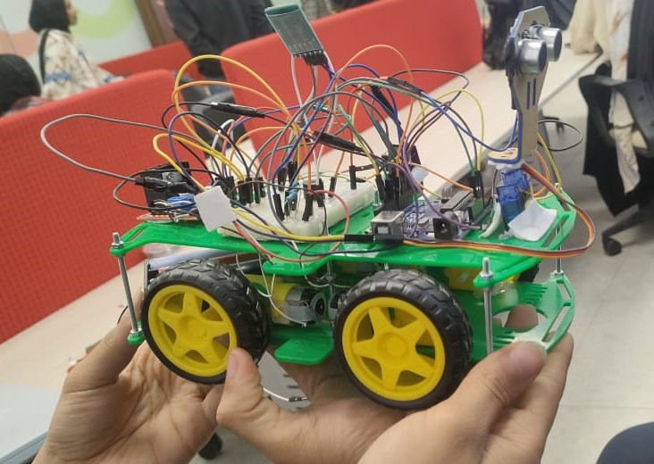
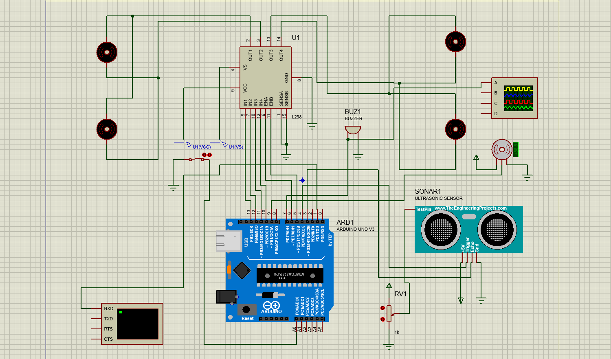

# Obstacle Avoidance Car 🚗💨


## 📌 Overview

This project is an **Obstacle Avoidance Car** built using **Arduino Uno**. The car is designed to navigate autonomously, avoiding obstacles using an ultrasonic sensor. Additionally, it can be controlled remotely via Bluetooth.

## 🔧 Components Used

- **Arduino Uno** 🟦  
- **4 DC Motors** ⚙️  
- **L298 Motor Driver** 🔌  
- **Servo Motor** 🔄  
- **Ultrasonic Sensor (HC-SR04)** 📡  
- **Buzzer** 🔊  
- **Switch Button** 🔘  
- **Bluetooth Module (HC-05)** 📶  

## ⚙️ Features

- **Autonomous Obstacle Avoidance** 🏎️  
- **Bluetooth Control** via a mobile app 📱  
- **Buzzer Alerts** when detecting obstacles 🔔  
- **Servo Mechanism** for dynamic obstacle detection 🔄  

## 📜 Installation & Usage

1. Clone the repository:  
   ```sh
   git clone https://github.com/kareem333j/obstacle-avoidance-car.git
2. Assemble the parts as shown in the picture except for the oscilloscope.
   

4. Open the .ino file in Arduino IDE.

5. Connect the Arduino Uno to your computer via USB.

6. Upload the code to the Arduino Uno by clicking the Upload button in Arduino IDE.

7. Power the motor driver and other components correctly.

8. Connect to Bluetooth using a mobile app that supports HC-05.

Run the car and test both:

